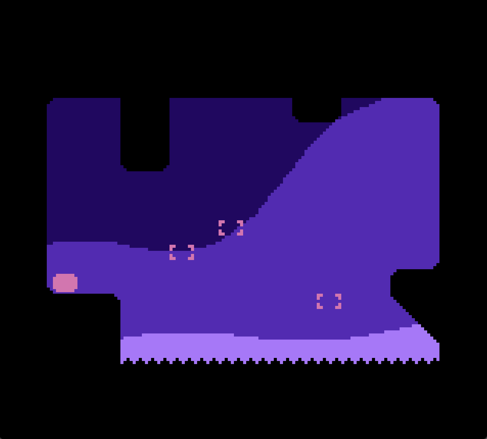

# agwan

> a game without a name

A micro-puzzle platformer, where after your first move, elements of the game disappear.



---

# quicklöve 

Starter project files to prototype ideas quicker. 
Don't get bogged with boilerplate.

> [!IMPORTANT]
> This template uses [middleclass](https://github.com/kikito/middleclass?tab=readme-ov-file) for basic OOP structuring, and [anim8](https://github.com/kikito/anim8/tree/master) for easier animation handling.
>
> Both are included in each `game/utils/` directory by default.

> [!WARNING]
> The **quicklöve** template, as outlined in `conf.lua` uses the classic gameboy aspect ratio by default, which is then scaled by 4.
>
> This means all our assets can be created for this 'style', then scaled up. In this codebase, this is done through the `ScalingFactor` global variable, which should be used to scale up each draw cycle prior to rendering sprites, and popped off the draw stack before rendering things like text.
>
> However, this technique of scaling can catch you out when using things like mouse coordinates, which need to be scaled down by `ScalingFactor` before transitioning to game logic.
> I.e, an `Entity`, in logic, might be have `position.x=4`, yet it will be rendered at `x=16`, and if you try click on it as part of your game, the mouse will be at `x=16`, thus needing to be scaled down.

---

## Running the development build

Execute this from top-most directory of your created game folder

```
/Applications/love.app/Contents/MacOS/love game
```

## Building

### Web Building

To build for web in order to publish to itch.io,

```bash
npm i love.js
```

```bash
npx love.js game build
```

then zip the build and upload it.

This repository has had issues with this technique of building. An alternative approach is to zip the **contents** of the `game/` directory, not `game/` itself into `build.love` then run

```bash
npx love.js game/build.love build
```

>[!CAUTION]
> Due to quirks with `love.js` make sure to turn on the experimental `SharedArrayBuffer` support option
